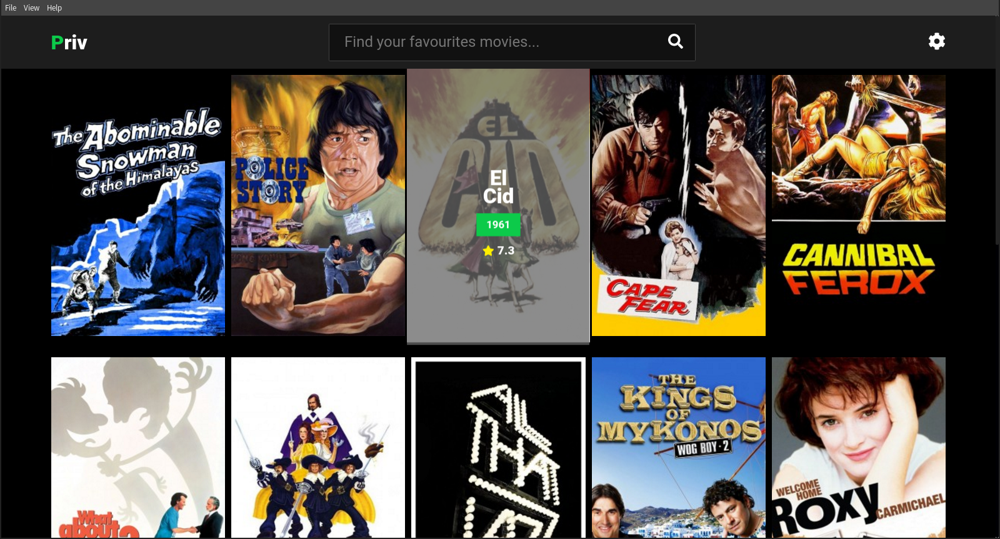

# Priv 



### Watch movies for free using torrents from [YTS](https://yts.am/)

Priv is a [electron](https://electronjs.org/) based movie player, it was created with the purpose of develop my skills on using React, Electron, Redux and so on...

The program implements the free API REST from YTS ([https://yts.am/api](https://yts.am/api)) and the [webtorrent](https://webtorrent.io/) library in order to play the movies on demand, also Priv downloads subtitles to every movie from [YIFY](http://www.yifysubtitles.com).

-------

## Development

To run Priv on a development enviroment, you must clone this repository on your computer, following this instructions (**NodeJS** is required): 

```bash
$ git clone https://github.com/miguelcostero/priv
$ cd priv
$ npm run dev
```
Or if you prefer yarn: `yarn dev`.

For more development info, Priv was created based on [@chentsulin](https://github.com/chentsulin) [electron react boilerplate](https://github.com/chentsulin/electron-react-boilerplate).

--------

## Production

Since Priv is a electron desktop app, it is necessary to create a package based on the platform (Windows, OS X, Linux) the user wants to run it. 

### Build for local platform

``` bash
$ npm run package
```

### Build for all platforms

First, refer to [Multi Platform Build](https://www.electron.build/multi-platform-build) for dependencies.

Then

```bash
$ npm run package-all
```

To package Priv with options: 

```bash
$ npm run package -- --[options]
```

--------

## Copyright
- [Miguel Costero](https://miguelcostero.com.ve)

## License

[MIT](https://opensource.org/licenses/MIT)
